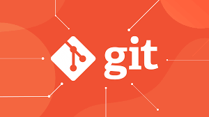

#  🌟 What is Git ?

- Definition:
#### Git is a version control system (VCS).
- Purpose:
#### It helps developers track changes in their code over time.
## Why Use It?
- Saves different versions of a project.
- Allows collaboration without messing up each other’s work.
- Easy to revert back if something breaks.
## How It Works:
- Tracks changes in snapshots called commits.
- Supports branches, so developers can work on features separately.
#
#  🔧 Key Git Features
### 1. Local & Distributed
- You have your own local copy of the entire project history.
### 2. Branches & Merges
- Safely experiment with new ideas and merge when ready.
### 3. Speed & Efficiency
- Fast operations, even on large projects.
#
# 🌐 What is GitHub ?
.jpeg)
- Definition:
#### GitHub is a platform built on top of Git.
- Purpose:
#### It hosts Git repositories online, making it easier to share and collaborate.
## Why Use It ?
- Collaboration: Work with people all over the world.
- Backup: Stores code safely in the cloud.
- Community: Open source projects and contribution opportunities.
# 🚀 Key GitHub Features
#### 1. Remote Repositories
- Share your project with others.
#### 2. Pull Requests
- Suggest and review changes before merging.
#### 3. Issues & Project Boards
- Track bugs, plan features, and manage tasks.
#### 4. Actions & CI/CD
- Automate workflows like testing and deployment.
